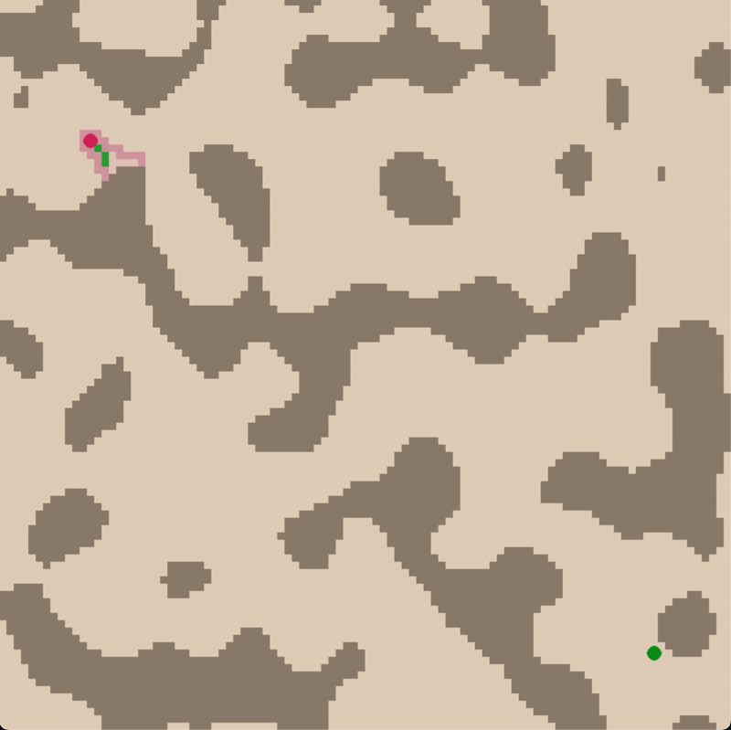

# A-Star Demo


# Installation of Dependencies
Run the following command
```bash
pip install -r requirements.txt
```

# Running the Program
```bash
python3 .
```

# Controls
+ `arrow keys`: move around the world
+ `r`: generate a new map